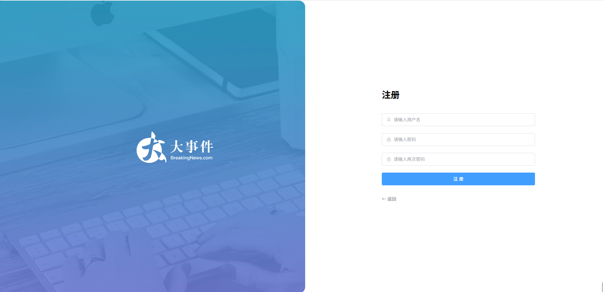
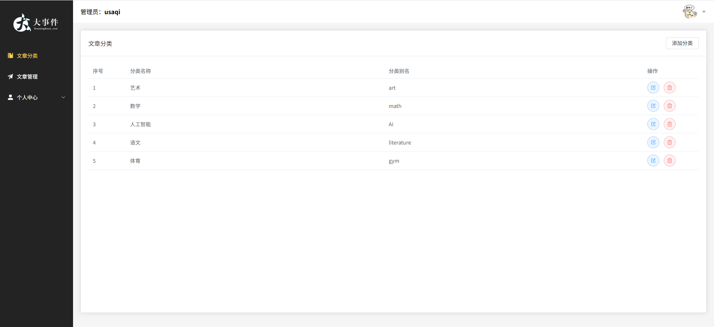
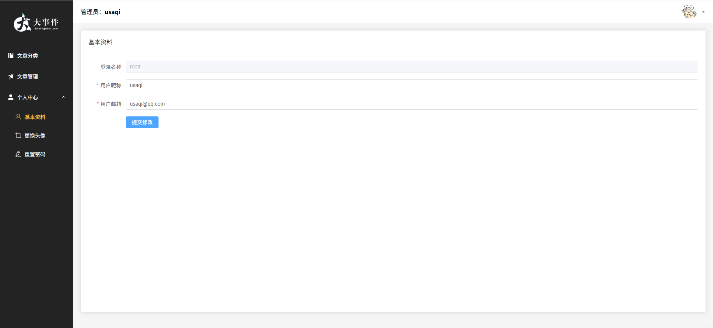
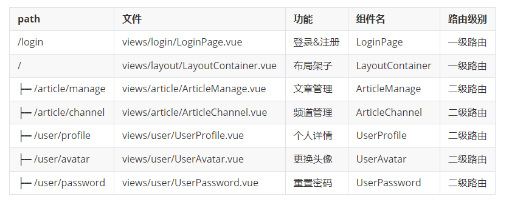

# 项目页面介绍
| 页面1 | 页面2 |
|-------|-------|
|  |  |

| 页面3 | 页面4 |
|-------|-------|
|  |  |

## 创建项目

1. pnpm 包管理器
2. 安装了插件 ESlint，开启保存自动修复
3. 禁用了插件 Prettier，并关闭保存自动格式化
4. 基于 husky  的代码检查工作流

## 调整项目目录

默认生成的目录结构不满足我们的开发需求，所以这里需要做一些自定义改动。主要是两个工作：

- 删除初始化的默认文件
- 修改剩余代码内容
- 新增调整我们需要的目录结构
- 拷贝初始化资源文件，安装预处理器插件

1. 删除文件
2. 修改内容
3. 新增需要目录 api  utils
4. 将项目需要的全局样式 和 图片文件，复制到 assets 文件夹中,  并将全局样式在main.js中引入

## 项目
**引入 element-ui 组件库** 
官方文档： https://element-plus.org/zh-CN/

**Pinia - 构建用户仓库 和 持久化**
pinia 独立维护
\- 现在：初始化代码在 main.js 中，仓库代码在 stores 中，代码分散职能不单一
\- 优化：由 stores 统一维护，在 stores/index.js 中完成 pinia 初始化，交付 main.js 使用

仓库 统一导出
\- 现在：使用一个仓库 import { useUserStore } from `./stores/user.js` 不同仓库路径不一致
\- 优化：由 stores/index.js 统一导出，导入路径统一 `./stores`，而且仓库维护在 stores/modules 中

**数据交互 - 请求工具设计**
1. 创建 axios 实例
2. 完成 axios 基本配置 

**首页整体路由设计**
- 完成整体路由规划【搞清楚要做几个页面，它们分别在哪个路由下面，怎么跳转的.....】
- 通过观察,  点击左侧导航,  右侧区域在切换,  那右侧区域内容一直在变,  那这个地方就是一个路由的出口
- 我们需要搭建嵌套路由

约定路由规则

### 登录注册页面 [element-plus 表单 & 表单校验]
**注册登录 静态结构 & 基本切换**

**实现注册校验**
【需求】注册页面基本校验

1. 用户名非空，长度校验5-10位
2. 密码非空，长度校验6-15位
3. 再次输入密码，非空，长度校验6-15位

再次输入密码需要自定义校验规则，和密码框值一致。

实现：通过 model 属性绑定 form 数据对象，再通过 v-model 绑定 form 数据对象的子属性，rules 配置校验规则，最后 prop 绑定校验规则。注册校验类似。

**封装 api 实现注册功能**
实现：新建 api/user.js 封装， 页面中调用。注意在eslintrc 中声明全局变量名,  解决 ElMessage 报错问题。

**登录功能校验**
给输入框添加表单校验
1. 用户名不能为空，用户名必须是5-10位的字符，失去焦点 和 修改内容时触发校验
2. 密码不能为空，密码必须是6-15位的字符，失去焦点 和 修改内容时触发校验

实现：model 属性绑定 form 数据对象，直接绑定之前提供好的数据对象即可。rules 配置校验规则，共用注册的规则即可。v-model 绑定 form 数据对象的子属性。prop 绑定校验规则。切换的时候重置输入框内容。其实都是前面类似的实现。

**登录前的预校验 & 登录成功**
1. 登录之前的预校验
- 登录请求之前，需要对用户的输入内容，进行校验
- 校验通过才发送请求

2. 登录功能
- 封装登录API，点击按钮发送登录请求
- 登录成功存储token，存入pinia 和 持久化本地storage
- 跳转到首页，给提示

实现：注册事件，进行登录前的预校验 (获取到组件调用方法)，封装接口 API，调用方法将 token 存入 pinia 并，自动持久化本地。

### 首页 layout 架子 [element-plus 菜单]
**架子组件列表：**

el-container
- el-aside 左侧
  - el-menu 左侧边栏菜单
- el-container  右侧
  - el-header  右侧头部
    - el-dropdown
  - el-main  右侧主体
    - router-view

注意：只有登录页，可以未授权的时候访问，其他所有页面，都需要先登录再访问。

**用户基本信息获取&渲染**
1. api/user.js封装接口
2. stores/modules/user.js 定义数据
3. layout/LayoutContainer页面中调用
4. 动态渲染

**退出功能 [element-plus 确认框]**
1. 注册点击事件
2. 添加退出功能
3. pinia  user.js 模块，提供 setUser 方法

### 文章分类页面 - [element-plus 表格]
**基本架子 - PageContainer**

1. 基本结构样式，用到了 el-card 组件
2. 考虑到多个页面复用，封装成组件
   - props 定制标题
   - 默认插槽 default 定制内容主体
   - 具名插槽 extra  定制头部右侧额外的按钮
3. 页面中直接使用测试 ( unplugin-vue-components 会自动注册)
- 文章管理测试：

**文章分类渲染**
封装API - 请求获取表格数据

1.  新建 api/article.js封装获取频道列表的接口
2. 页面中调用接口，获取数据存储

- el-table 表格 loading 效果

1. 定义变量，v-loading绑定
2. 发送请求前开启，请求结束关闭

### 文章分类添加编辑 [element-plus 弹层]
点击显示弹层，绑定点击事件触发弹层。

**封装弹层组件 ChannelEdit**

添加 和 编辑，可以共用一个弹层，所以可以将弹层封装成一个组件。组件对外暴露一个方法 open,  基于 open 的参数，初始化表单数据，并判断区分是**添加**还是**编辑**。
1. open({ })                   =>  添加操作，添加表单初始化无数据
2. open({ id: xx,  ...  })  =>  编辑操作，编辑表单初始化需回显

**准备弹层表单**

1. 准备数据 和 校验规则
2. 准备表单
3. 编辑需要回显，表单数据需要初始化
4. 基于传过来的表单数据，进行标题控制，有 id 的是编辑
最后确认提交，页面中校验，判断，提交请求，通知父组件进行回显，父组件监听 success 事件，进行调用回显。

**文章分类删除**

1. api/article.js封装接口 api
2. 页面中添加确认框，调用接口进行提示

### 文章管理页面 - [element-plus 强化]

**文章分类选择**
为了便于维护，直接拆分成一个小组件 ChannelSelect.vue。
同样的，使用v-model绑定。封装api接口，请求渲染。

**分页渲染 [element-plus 分页]**
使用分页组件el-pagination，提供分页修改逻辑。并且加一个loading效果。

### 文章发布&修改 [element-plus - 抽屉]
点击修改，显示抽屉
**封装抽屉组件 ArticleEdit**
添加 和 编辑，可以共用一个抽屉，所以可以将抽屉封装成一个组件
组件对外暴露一个方法 open,  基于 open 的参数，初始化表单数据，并判断区分是添加 还是 编辑

1. open({ })                   =>  添加操作，添加表单初始化无数据
2. open({ id: xx,  ...  })  =>  编辑操作，编辑表单初始化需回显

上传头像文件，并做一个预览。文本编辑器使用富文本编辑器 [ vue-quill ]。
添加、编辑、删除文章功能类似，不再赘述。同样的修改完之后需要把文本输入框内容重置。

### 个人中心
这一部分的内容和功能其实都是类似的，因此不再详细说明。